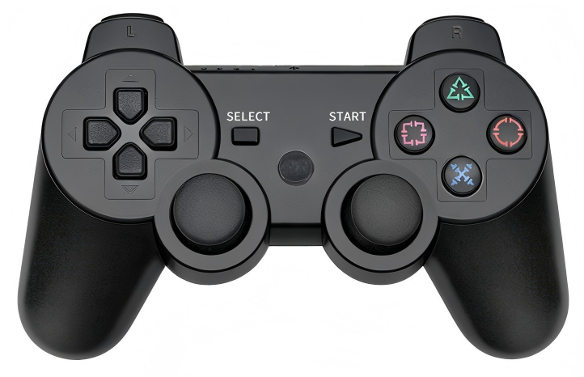
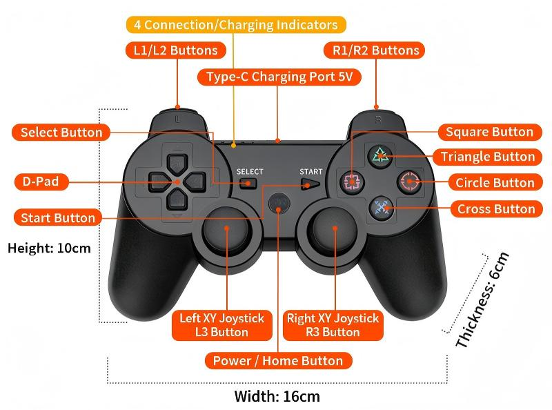
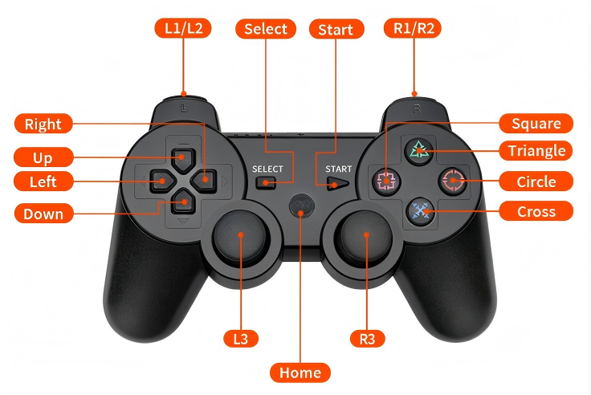

# CodexPad-S10

[中文](README.zh-CN.md)

## Overview

**CodexPad-S10** is a Bluetooth Low Energy controller from the CodexPad series, designed specifically for makers and embedded developers.  
Unlike conventional controllers that depend on an operating system’s Bluetooth stack, this product is **built for OS‑less hardware platforms**. It can establish peer‑to‑peer communication directly with bare‑metal BLE devices such as **ESP32**, **ESP32‑S**, **ESP32‑C**, **STM32**, **nRF**, **micro:bit**, **Raspberry Pi**, and similar boards — no operating system required. This makes it an out‑of‑the‑box remote physical input solution for robots, IoT devices, custom control panels, and more.

We provide a clean communication protocol, lightweight driver libraries, and a wide range of examples for supported platforms, so you can integrate the controller into your firmware quickly and focus on your core application.

---

## Product Appearance

---

## Product Component Diagram

---

## Button Diagram

---

## Input Device Specifications

- Number of buttons: 17  
- Number of joysticks: 2  
- Joystick type: dual‑axis analog  
- Joystick resolution: 8‑bit (0 – 255)

---

## Electrical Characteristics

- Charging voltage / current: 5 V / 500 mA (USB Type‑C)  
- Battery capacity: 400 mAh  
- Charging time: approximately 1.5 hours  
- Battery life: approximately 8 hours under typical use

---

## Connectivity and Protocol

- Bluetooth version: Bluetooth Low Energy 5.3  
- Transmission distance: up to 50 m (open area)  
- Transmit power: **‑16 dBm** to **+6 dBm** (adjustable)  
- Communication protocol: open, lightweight binary protocol optimized for embedded systems  
- Supported role: BLE peripheral (slave)

---

## Powering On and Off

- **Power on**: Briefly press (click) the **Home button** in the centre of the controller. The No. 1 blue LED indicator will start blinking slowly, indicating the device is starting up.
- **Power off**: While powered on, **long‑press the Home button for 3 seconds**. The No. 1 blue LED indicator will turn off and the device will shut down.

> **💡 Tip**: If the controller shows **no LED response at all** after you attempt to power it on, or **the LEDs turn on but go out immediately**, the battery is most likely fully drained and cannot support startup or stable operation. Please charge the controller with a USB Type‑C cable first, then try again.

---

## LED Indicator Description

- **No. 1 Indicator (Blue)**: Operating status indicator

    | No. 1 LED Status | Device Status |
    | :--- | :--- |
    | Slow blinking (approx. 1 s on/off) | Powered on, advertising, and ready to connect |
    | Solid on | Powered on and successfully connected to a host device |
    | Off | Powered off |

- **No. 2, 3, 4 Indicators (Green)**: Battery level and charging status indicators

  **Together these three LEDs form a three‑bar battery gauge that shows the remaining capacity or charging state at a glance**.

  - *When the device is powered on and **not charging**, they display the current battery level:*

      | LED Status (No. 2 / 3 / 4) | Battery Level |
      | :--- | :--- |
      | All three on (full bars) | High |
      | No. 2 and 3 on, No. 4 off (two bars) | Medium |
      | Only No. 2 on, No. 3 and 4 off (one bar) | Low (*charge recommended; may auto‑shutoff when reaching the minimum protection voltage*) |

  - *When the device is **connected to a charger**, they display the charging state:*

      | LED Status (No. 2 / 3 / 4) | Charging State |
      | :--- | :--- |
      | The three LEDs cycle on in sequence (running‑light effect) | Charging in progress |
      | All three on solidly | Charging complete |

---

## Auto Power‑Off

To conserve power, the controller will automatically shut down under the following two conditions:

1. **Low‑battery auto power‑off**: When the battery drains to the minimum protection voltage, the controller powers off automatically and all LEDs turn off. This is a battery protection mechanism. **Please recharge promptly.** The controller will power on normally after charging.

2. **Broadcast timeout auto power‑off**: After power‑on, if the controller remains in the **slow‑blinking** state (advertising and waiting for a connection) for **more than 1 minute** without being connected, it will turn itself off to save power.

> **💡 Tip**: If the controller shuts down shortly after power‑on, first check the battery level indicators, or try to complete the Bluetooth connection as quickly as possible after turning it on.

---

## Obtaining the Bluetooth Device Address (BD_ADDR)

When connecting to a CodexPad, you may need the device’s **unique** identifier: the **Bluetooth Device Address**. It acts like an “ID number” for the device, formatted as 12 hexadecimal characters separated by colons: `XX:XX:XX:XX:XX:XX` (where `X` is 0–9 or A–F), for example `E4:66:E5:A2:24:5D`.

The Bluetooth Device Address (BD_ADDR) is printed on the label located **in the centre of the controller’s back panel**. Please check and record it yourself.

---

## Charging and Battery Maintenance

To extend the lifespan of the built‑in lithium battery, follow these charging and care guidelines:

- **Avoid overcharging; disconnect when full**: Lithium batteries do not need a “12‑hour first charge” activation. When the green LEDs No. 2‑4 stay **solid on** (fully charged), disconnect the charger promptly. Avoid leaving the controller plugged in for extended periods (e.g., overnight or for several days) — staying at 100 % charge for a long time accelerates battery ageing.

- **Charge as needed; avoid deep discharge**: You don’t have to wait until the battery is completely empty to recharge. When the battery gauge shows **low** (only LED 2 is on), you can charge the controller. Frequent deep discharge (to auto‑power‑off) significantly shortens battery life.

- **Use a suitable charger**: Please use a standards‑compliant 5 V / 1 A (or 5 V / 500 mA) USB charger or a computer USB port. **Avoid using fast chargers** — excessive current may cause the battery to heat up, affecting safety and lifespan.

- **Charge in a suitable environment**: Whenever possible, charge at room temperature (0 °C – 35 °C). Extreme high temperatures (e.g. inside a car in summer) or very low temperatures will seriously reduce charging efficiency and harm battery health.

- **Long‑term storage**: If you plan not to use the controller for an extended period (more than one month), charge the battery to a **medium level** (around 50 %–60 %, i.e. LEDs 2 and 3 on, LED 4 off) and store it in a cool, dry place. Never store the controller for long periods either fully charged or fully drained.

---

## Connection and Usage Guide

| Hardware Platform Characteristics | Typical Representative Platforms | Documentation | Core Features |
| :--- | :--- | :--- | :--- |
| Main controller has built-in BLE capability or a BLE coprocessor, and the software can directly call low-level BLE APIs to connect to devices | <ul><li>ESP32</li><li>ESP32-S2</li><li>ESP32-S3</li><li>ESP32-C3</li><li>ESP32-C5</li><li>ESP32-C6</li><li>ESP32-H2</li><li>ESP32-P4</li><li>Raspberry Pi Pico W</li><li>Raspberry Pi Pico 2 W</li><li>micro:bit v2</li></ul> | [CodexPad Connection and Usage Guide: Using the Built-in BLE of Hardware Platforms](../../../codex_pad_guide/blob/main/docs/en/connection_guide_native_ble.md#codexpad-connection-and-usage-guide-using-the-built-in-ble-of-hardware-platforms) | No external module required; libraries and examples provided for direct programming use |
| Main controller (e.g. STM32/Arduino) lacks Bluetooth and requires an external Bluetooth-to-Serial module (connected to TX/RX pins) | <ul><li>Arduino UNO + NL16</li><li>BLE UNO (same as Arduino UNO + NL16)</li><li>STM32 + HC05</li><li>Arduino UNO + HC05</li></ul> | [CodexPad Connection and Usage Guide: Using BLE to Serial Module](../../../codex_pad_guide/blob/main/docs/en/connection_guide_ble_uart.md#codexpad-connection-and-usage-guide-using-ble-to-serial-module) | **Passthrough mode**; data forwarded via serial port |
| Main controller (e.g. STM32/Arduino) lacks Bluetooth and requires a CodexPad dedicated receiver on the I2C bus (under development) | Any hardware platform supporting I2C | [CodexPad Connection and Usage Guide: Using the Dedicated BLE to I2C Receiver](../../../codex_pad_guide/blob/main/connection_guide_i2c_receiver.md#en/connection_guide_i2c_receiver.md#codexpad-connection-and-usage-guide-using-the-dedicated-ble-to-i2c-receiver) | |

---

## Important Notes

[Important Notes](../../../codex_pad_guide/blob/main/docs/en/notice.md#important-notes)
